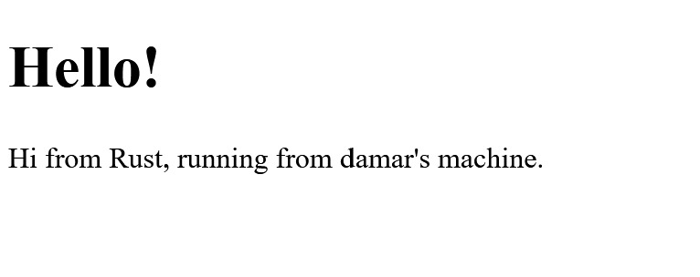
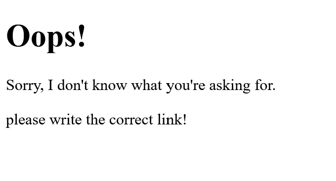

# Rust - Concurrency

## Athallah Damar Jiwanto - B - 2306245024

### Module 6

> Milestone 1

Saat ini, kita telah mengembangkan fungsi handle_connection yang berfungsi untuk menangani koneksi dari browser. Fungsi ini menerima objek TcpStream yang didapat dari TcpListener. Dengan menggunakan BufReader, fungsi ini membaca permintaan HTTP secara bertahap, baris per baris, sampai menemukan baris kosong yang menandakan bahwa header permintaan telah selesai. Setelah proses pembacaan selesai, permintaan tersebut disimpan dalam sebuah vektor yang berisi setiap baris sebagai string dan ditampilkan di konsol. Meskipun aplikasi ini sudah berhasil menerima dan menampilkan permintaan dari browser, respons kepada browser belum dapat diberikan.

> Milestone 2

Fungsi handle_connection dalam kode ini bertugas untuk menangani koneksi yang masuk dari klien, seperti browser, menggunakan objek TcpStream. Fungsi ini membaca permintaan HTTP yang diterima melalui stream menggunakan BufReader dan mengumpulkan baris-baris permintaan hingga menemukan baris kosong, yang menandakan akhir dari header permintaan. Setelah itu, fungsi ini menyiapkan respons HTTP dengan status "200 OK" dan membaca konten dari file hello.html. Panjang konten tersebut dihitung dan ditambahkan dalam header Content-Length. Respons kemudian diformat dengan lengkap dan dikirim kembali ke klien melalui stream, sehingga klien menerima respons yang berisi konten dari file hello.html.

```rust
    let status_line = "HTTP/1.1 200 OK";
    let contents = fs::read_to_string("hello.html").unwrap();
    let length = contents.len();

    let response = format!("{status_line}\r\nContent-Length: {length}\r\n\r\n{contents}");

    stream.write_all(response.as_bytes()).unwrap();
```



> Milestone 3

Untuk membedakan antara respons yang sukses seperti `200 OK` dan respons error seperti `404 NOT FOUND`, kita dapat memisahkan logika pengolahan respons menjadi bagian yang lebih terstruktur. Misalnya, kita bisa membuat fungsi atau modul terpisah untuk menangani pembuatan respons, seperti memisahkan bagian format status, header, dan konten. Ini akan meningkatkan keterbacaan dan pemeliharaan kode, karena kita tidak perlu menulis ulang logika yang sama untuk setiap jenis respons. Selain itu, refaktoring seperti ini juga membuat kode lebih modular dan dapat digunakan kembali, memungkinkan penanganan berbagai jenis respons dalam satu tempat. Refaktoring ini penting untuk menjaga konsistensi, meminimalkan duplikasi kode, dan memungkinkan pengembangan lebih lanjut tanpa merusak struktur kode yang ada. Dengan memisahkan logika pengolahan respons, kita juga mempermudah pengujian unit dan debugging aplikasi secara keseluruhan.

```rust
fn handle_connection(mut stream: TcpStream) {
    let buf_reader = BufReader::new(&stream);
    let request_line = buf_reader.lines().next().unwrap().unwrap();

    if request_line == "GET / HTTP/1.1" {
        let status_line = "HTTP/1.1 200 OK";
        let contents = fs::read_to_string("hello.html").unwrap();
        let length = contents.len();

        let response = format!(
            "{status_line}\r\nContent-Length: {length}\r\n\r\n{contents}"
        );

        stream.write_all(response.as_bytes()).unwrap();
    } else {
        let status_line = "HTTP/1.1 404 NOT FOUND";
        let contents = fs::read_to_string("404.html").unwrap();
        let length = contents.len();

        let response = format!(
            "{status_line}\r\nContent-Length: {length}\r\n\r\n{contents}"
        );

        stream.write_all(response.as_bytes()).unwrap();
    }
}
```

